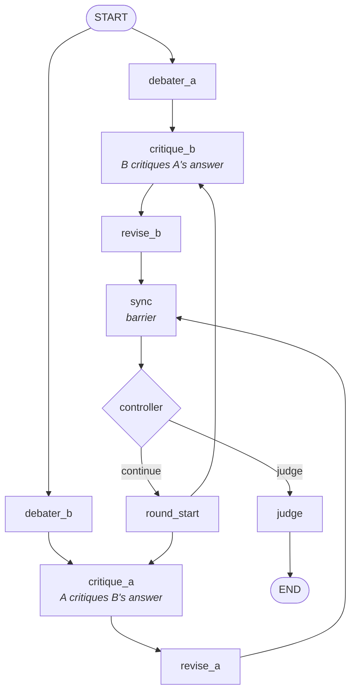
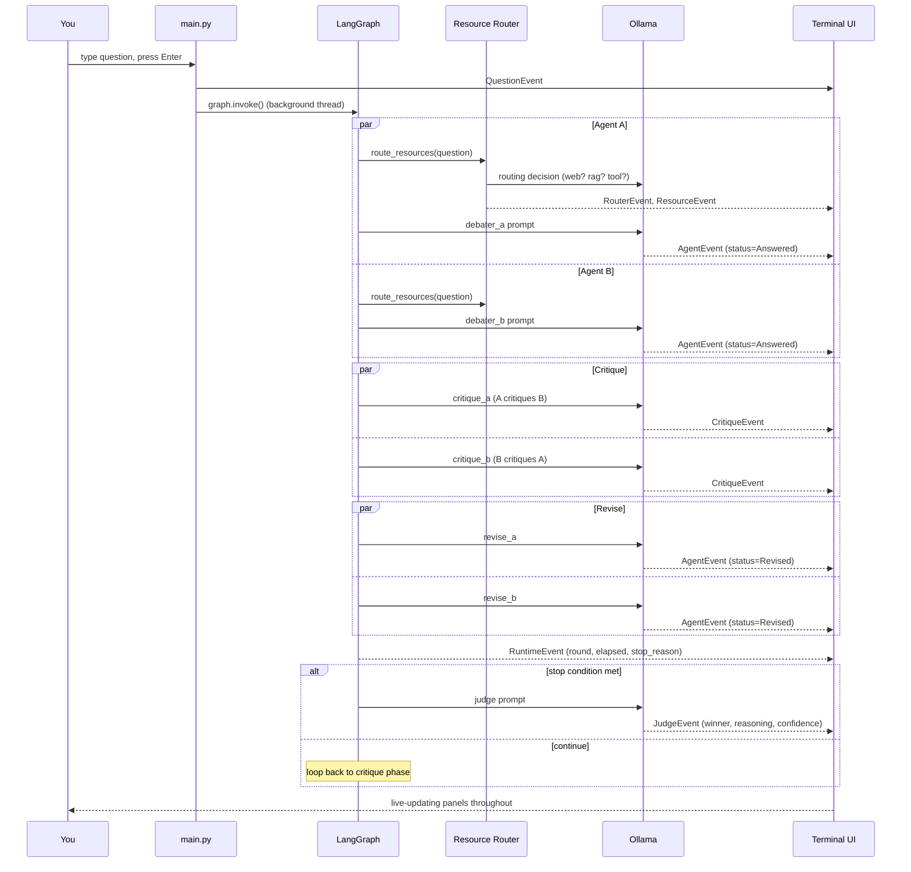

# Local LLM Debate

Two locally-run LLMs independently answer a question, critique each other's answers, revise based on the critique, and repeat until a stopping condition is met — at which point an impartial judge picks a winner. A live terminal UI shows routing decisions, retrieved resources, both agents' answers, critiques, and the judge's verdict as they happen, in real time.

Everything runs **locally** via [Ollama](https://ollama.com) — no API keys, no cloud calls for the LLM itself (web search is the one exception, used only when the router decides a question needs current information).

---

## Features

- **Multi-agent debate** : two independent debaters (`Agent A`, `Agent B`), each with their own critique-and-revise loop
- **Resource routing** : an LLM router decides per-question whether to use web search, local document retrieval (RAG), a Python calculator tool, or none
- **RAG support** : upload a PDF inline at startup; it's chunked, embedded, and made searchable for that session
- **Live terminal UI** : built with [Rich](https://github.com/Textualize/rich), fully event-driven, decoupled from the debate engine
- **Scrollable panels** : click to focus, scroll with `j`/`k`, arrow keys, or mouse wheel
- **Automatic cleanup** : uploaded documents and their vector store are wiped after each session

---

## Architecture

The project is split into two halves that **never import from each other directly**. The debate engine only knows how to `emit()` events; the UI only knows how to consume them. This means the terminal UI could be swapped for a web UI, a logger, or nothing at all, without touching the debate logic.

```mermaid
flowchart LR
    subgraph Engine["Debate Engine (LangGraph)"]
        G[graph.py] --> A1[agents/debater_a.py]
        G --> A2[agents/debater_b.py]
        G --> J[agents/judge.py]
        G --> C[agents/debate_controller.py]
        A1 --> RM[tools/resource_manager.py]
        A2 --> RM
        RM --> WEB[tools/search.py]
        RM --> RAG[rag/retriever.py]
        RM --> PY[tools/python_tool.py]
        RM --> ROUTE[tools/resource_router.py]
    end

    subgraph Bridge["Event Bus"]
        EM[ui/emitter.py] --> EB[(ui/event_bus.py<br/>thread-safe queue)]
    end

    subgraph UI["Terminal UI (Rich)"]
        EB --> R[ui/renderer.py]
        R --> ST[ui/state.py]
        R --> L[ui/layout.py]
        L --> P[ui/panels/*]
    end

    Engine -. emit&#40;Event&#41; .-> EM
    A1 -.-> EM
    A2 -.-> EM
    J -.-> EM
    C -.-> EM
    RM -.-> EM

    Ollama[(Ollama<br/>qwen2.5:3b / 1.5b)] -.-> A1
    Ollama -.-> A2
    Ollama -.-> J
    Ollama -.-> ROUTE
```



- **Engine → UI** is one-directional: the engine calls `emit(SomeEvent(...))`, which drops a dataclass onto a thread-safe queue (`ui/event_bus.py`).
- **`main.py`** runs the engine on a background thread and the Rich `Live` render loop on the main thread. They only ever talk through that queue — no shared mutable state, no locks needed beyond `queue.Queue`'s own thread safety.

---

## The debate graph

`graph.py` wires the LangGraph state machine. Both debaters answer in parallel, critique each other in parallel, revise in parallel, then synchronize before a controller decides whether to loop again or hand off to the judge.



**Stopping conditions** (checked each round by `tools/stopping.py`), evaluated in order:
1. Both agents' latest answers are identical → stop (`answers_converged`)
2. Both agents' hallucination risk is ≤ 2 → stop (`low_hallucination_risk`)
3. `round_number >= max_rounds` → stop (`max_rounds`)

---

## What happens on one question, end to end



---

## Requirements

- Python 3.10+
- [Ollama](https://ollama.com/download) installed and running
- A terminal with truecolor support (iTerm2, Windows Terminal, GNOME Terminal, Kitty, Alacritty — most modern terminals qualify)

---

## Setup

**macOS / Linux**
```bash
git clone https://github.com/SreenathKarthick11/Local_LLM_Debate.git
cd Local_LLM_Debate
./install.sh
```

The install script checks for Ollama, pulls the required models (`qwen2.5:3b`, `qwen2.5:1.5b`), creates a virtual environment, and installs the Python package.

---

## Run

```bash
source .venv/bin/activate
llm-debate
```

Want the command available globally without activating a venv every time? Use [pipx](https://pipx.pypa.io):
```bash
pipx install .
```

---

## Using the app

1. **Upload a PDF (optional).** On launch you'll see a picker listing PDFs found in your current folder, `~/Downloads`, `~/Documents`, and `~/Desktop`. Type a number, part of a filename, or a full path — or just press Enter to skip and answer without RAG.
2. **Type your question**, press Enter.
3. **Watch the debate unfold live:**

   | Panel | Shows |
   |---|---|
   | Router | which resources were used (web / RAG / tool) and why |
   | Resources | the actual retrieved web text / document chunks / tool output |
   | Agent A / Agent B | each debater's current status, answer, and confidence |
   | Critique A / Critique B | weaknesses and hallucination risk found in the opponent's answer |
   | Judge | the winner, confidence, and reasoning |
   | Runtime | round number, elapsed time, stop reason |

4. **Controls:**
   - Click any scrollable panel (Router, Resources, Agent A/B, Critique A/B, Judge) to focus it
   - `j` / `↓` and `k` / `↑` scroll the focused panel; mouse wheel scrolls directly under the cursor
   - `Ctrl+C` exits at any point — uploaded documents and the vector store are cleaned up automatically

### Explicit routing commands

Force a specific resource regardless of what the router would choose, by including these anywhere in your question:

| Command | Forces |
|---|---|
| `@web` | Web search |
| `@file` | Local document retrieval (RAG) |
| `@python` | The Python calculator tool |

Example: `What's the average of these numbers? @python`

---

## Notes on the local model setup

- `qwen2.5:3b` handles debating and judging; `qwen2.5:1.5b` handles the (cheaper, more frequent) critique and routing calls — this split keeps latency reasonable on consumer hardware.
- Structured output (`AgentResponse`, `CritiqueResponse`, `JudgeResponse`, `ResourceRoute`) is enforced via `.with_structured_output(...)` in `llm.py`, so parsing is schema-guaranteed rather than regex-scraped from free text.
- The embedding model (`BAAI/bge-small-en-v1.5`) downloads automatically on first RAG use — this requires internet access once, even though inference afterward is fully local.

---